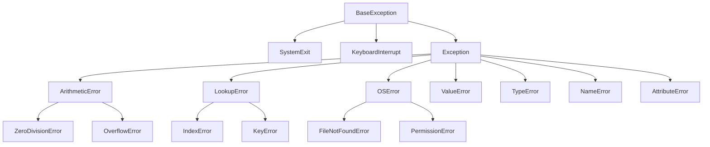

# 🐍 Python Exception Hierarchy Reference

Understanding the hierarchy of exceptions is crucial for writing clean code. Python's exceptions are organized in a tree structure; when you catch a parent class, you automatically catch all its child classes.

---

## 📊 Visual Hierarchy (Simplified)



---

## 🔝 Base Exceptions

All exceptions in Python inherit from `BaseException`. You should usually only catch `Exception`, not `BaseException`.

- **`BaseException`** (The root of all exceptions)
  - `SystemExit` (Raised by `sys.exit()`)
  - `KeyboardInterrupt` (Raised when user hits `Ctrl+C`)
  - `GeneratorExit` (Raised when a generator or coroutine is closed)
  - **`Exception`** (The base class for all non-exit exceptions - **Catch this!**)

---

## 🛠️ Standard Exceptions (Derived from `Exception`)

These are the most common exceptions you will encounter during development.

### 🔢 Arithmetic Errors

- `ArithmeticError` (Base class for arithmetic errors)
  - `FloatingPointError` (Floating point operation failure)
  - `OverflowError` (Result too large to be represented)
  - `ZeroDivisionError` (Division or modulo by zero)

### 📂 OS & File Errors (`OSError`)

- `OSError` (Base class for I/O and system-related errors)
  - `FileExistsError` (Trying to create a file that already exists)
  - `FileNotFoundError` (File or directory not found)
  - `IsADirectoryError` (Operation expected a file but got a directory)
  - `PermissionError` (Permission denied)
  - `TimeoutError` (System function timed out)

### 🔍 Lookup & Name Errors

- `LookupError` (Base class for lookup errors)
  - `IndexError` (Sequence index out of range)
  - `KeyError` (Mapping key not found)
- `NameError` (Identifier not found in local or global scope)
  - `UnboundLocalError` (Reference to a local variable before assignment)

### 🏗️ Structure & Syntax Errors

- `SyntaxError` (Invalid Python syntax)
  - `IndentationError` (Incorrect indentation)
    - `TabError` (Mixed tabs and spaces)
- `RuntimeError` (Error that doesn't fall into other categories)
  - `RecursionError` (Maximum recursion depth exceeded)
  - `NotImplementedError` (Abstract method not overridden)

### 🔡 Other Common Exceptions

- `AttributeError` (Attribute reference or assignment fails)
- `ImportError` (Module import fails)
  - `ModuleNotFoundError` (Module not found)
- `MemoryError` (Out of memory)
- `TypeError` (Operation applied to object of inappropriate type)
- `ValueError` (Inappropriate value for an operation)

---

## ⚠️ Warning Categories

Warnings are technical exceptions used to signal that some software usage is discouraged.

- `Warning` (The base class for warnings)
  - `UserWarning` (General warnings generated by user code)
  - `DeprecationWarning` (Features that will be removed in future)
  - `SyntaxWarning` (Dubious syntax)
  - `RuntimeWarning` (Dubious runtime behavior)
  - `FutureWarning` (Features changed in future)
  - `ImportWarning` (Possible mistakes in module imports)

---

## 💡 Pro Tip: Specificity is King

When catching exceptions, always start from the most specific (bottom of the tree) to the least specific (top of the tree).

```python
try:
    # do something
except FileNotFoundError: # ✅ Good: Specific
    # handle missing file
except Exception:          # ⚠️ Use sparingly: Broad
    # handle everything else
```

---

> [!IMPORTANT]
> **Data Science Tip**: When processing large datasets, use exception handling inside your loops to log "bad rows" instead of letting one bad value terminate a 10-hour training job!

---

_Created as part of the "Zero to Data Scientist" Foundation Series._
